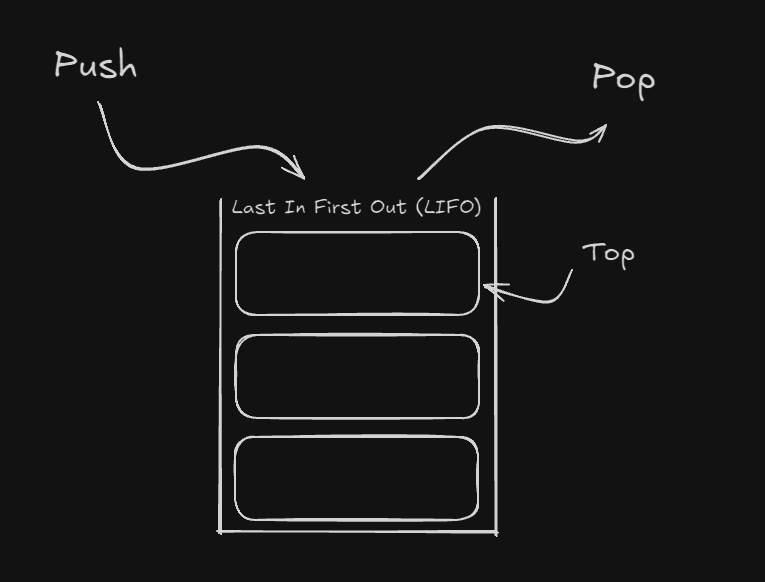

# Pilha (Stack)
Uma pilha é uma estrutura de dados linear que segue o princípio LIFO (Last In, First Out), onde o último elemento adicionado é o primeiro a ser removido. Ela pode ser visualizada como uma pilha de pratos, onde só é possível adicionar ou remover o prato que está no topo.

---

## Tipos de Pilha

- **Pilha Estática**: Implementada usando um array fixo. A capacidade da pilha é definida no momento da criação e não pode ser alterada.
- **Pilha Dinâmica**: Implementada usando listas encadeadas, permitindo que a pilha cresça ou diminua conforme necessário, sem limitações de capacidade fixa.

---

## Operações em Pilhas

As pilhas oferecem um conjunto básico de operações que incluem:

- **Empilhar(Push)**: Adiciona um elemento ao topo da pilha.
- **Desempilhar(Pop)**: Remove e retorna o elemento do topo da pilha.
- **Topo(Top)**: Retorna o elemento no topo da pilha sem removê-lo
- **EstaVazia(IsEmpty)**: Verifica se a pilha está vazia.
- **EstaCheia(IsFull)**: Verifica se a pilha está cheia.

---

## Funcionamento da Pilha

- Um ponteiro chamado **`topo`** é usado para controlar o último elemento da pilha.
- Quando inicializamos a pilha definimos o topo como -1 para que possamos checar se a pilha está vazia comparando `topo == -1` .
- Quando empilhamos um elemento, incrementamos o valor de **`topo`** e inserimos o novo elemento na posição apontada por ele.
- Quando desempilhamos um elemento, retornamos o elemento apontado por `topo` e decrementamos seu valor.
- Antes de empilhar, verificamos se a pilha está cheia.
- Antes de desempilhar, verificamos se a pilha está vazia.

---

## Aplicações da Pilha

- **Desfazer e Refazer**: Implementação de funcionalidades de desfazer/refazer em aplicações, onde cada ação é armazenada em uma pilha.
- **Navegadores**: Quando você navega de uma página para outra, cada página visitada é empilhada em uma pilha de histórico.
- **Avaliação de Expressões**: Usadas na conversão e avaliação de expressões matemáticas, como converter de notação infixa para pós-fixa.
- **Gerenciamento de Chamadas de Funções**: As pilhas são usadas para rastrear chamadas de função, permitindo a execução correta e o retorno ao ponto de chamada após a conclusão da função.

---

## Complexidade de Operações em Pilhas

| Operações | Complexidade |
| --- | --- |
| push() | O(1) |
| pop() | O(1) |
| peek() | O(1) |
| isEmpty() | O(1) |
| isFull() | O(1) |